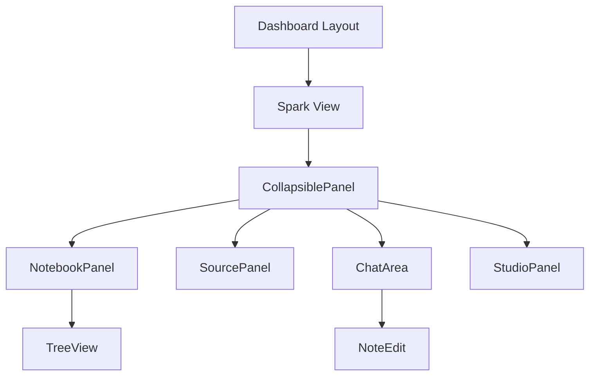

# Spark Implementation Plan

## Directory Structure

```
frontend/
├── src/
│   ├── components/
│   │   ├── common/              # Reusable components across the system
│   │   │   ├── CollapsiblePanel/
│   │   │   │   ├── index.tsx
│   │   │   │   └── styles.ts
│   │   │   └── TreeView/       # Custom tree view implementation
│   │   ├── layout/             # Layout components
│   │   │   └── Dashboard/      # Main dashboard layout
│   │   └── spark/             # Spark-specific components
│   │       ├── NotebookPanel/
│   │       │   ├── index.tsx
│   │       │   ├── NotebookItem.tsx
│   │       │   └── styles.ts
│   │       ├── SourcePanel/
│   │       ├── ChatArea/
│   │       │   ├── index.tsx
│   │       │   ├── MessageBubble.tsx
│   │       │   └── ChatInput.tsx
│   │       ├── StudioPanel/
│   │       └── NoteEdit/
│   ├── features/              # Feature-specific logic and state
│   │   └── spark/
│   │       ├── types.ts
│   │       ├── context.tsx
│   │       └── hooks/
│   ├── pages/
│   │   └── spark/
│   │       └── index.tsx
│   └── services/             # API and service integrations
│       └── spark/
│           ├── api.ts
│           └── transformers.ts
```

## Implementation Phases

### Phase 1: Basic Setup and Navigation
**Required Files for Review:**
- `/frontend/src/components/SideMenu.tsx` - Current menu structure
- `/frontend/src/components/SideMenuMobile.tsx` - Mobile menu implementation
- `/frontend/src/theme/AppTheme.tsx` - Theme configuration
- `/frontend/src/pages/Dashboard.tsx` - Main dashboard layout

**Implementation Steps:**
1. Add Spark menu item to dashboard sidebar
2. Create basic layout structure
3. Implement CollapsiblePanel component
4. Set up basic routing and state management

```typescript
// Add to existing sidebar menu
const sparkMenuItem = {
  title: 'Spark',
  path: '/spark',
  icon: SparkIcon,
  children: [] // If we need sub-items
};
```

### Phase 2: Notebook Panel Implementation
**Required Files for Review:**
- `/frontend/src/theme/customizations/treeView.ts` - Tree view styling
- Any existing collapsible panel implementations
- Current state management setup

**Implementation Steps:**
1. Create NotebookPanel component with TreeView
2. Implement hover states and interactions
3. Add create/edit functionality
4. Set up notebook/note state management

### Phase 3: Source Panel Development
**Required Files for Review:**
- `/frontend/src/components/CustomizedDataGrid.tsx` - List view implementation
- Document management components
- File upload handling components

**Implementation Steps:**
1. Implement SourcePanel component
2. Add document list view
3. Create document selection mechanism
4. Link with NotebookPanel interactions

### Phase 4: Chat Interface
**Required Files for Review:**
- Existing chat/message components
- `/frontend/src/components/Content.tsx` - Main content area structure
- Current API integration setup

**Implementation Steps:**
1. Develop ChatArea component
2. Implement message display
3. Create chat input with suggestions
4. Set up AI integration points

### Phase 5: Studio Panel and Analysis Tools
**Required Files for Review:**
- `/frontend/src/components/StatCard.tsx` - Analysis display components
- `/frontend/src/components/ChartUserByCountry.tsx` - Chart implementation reference
- `/frontend/src/components/PageViewsBarChart.tsx` - Chart implementation reference
- `/frontend/src/components/SessionsChart.tsx` - Chart implementation reference

**Implementation Steps:**
1. Create StudioPanel component
2. Implement analysis tool interfaces
3. Add document preview functionality
4. Integrate with AI services

### Phase 6: Note Editing
**Required Files for Review:**
- Form components
- Modal/Dialog implementations
- Form validation setup

**Implementation Steps:**
1. Create NoteEdit component
2. Implement slide-over animation
3. Add form fields and validation
4. Set up save/delete functionality

### Phase 7: Integration and Polish
**Required Files for Review:**
- `/frontend/src/components/Header.tsx` - Header integration
- `/frontend/src/components/AppNavbar.tsx` - Navigation structure
- `/frontend/src/theme/customizations/index.ts` - Theme customizations

**Implementation Steps:**
1. Connect all components
2. Implement responsive behavior
3. Add loading states and error handling
4. Polish transitions and animations

## Component Dependencies



## State Management Structure

```typescript
interface SparkState {
  notebooks: {
    items: NotebookItem[];
    selected: string | null;
    editing: string | null;
  };
  sources: {
    items: SourceItem[];
    selected: string[];
  };
  chat: {
    messages: Message[];
    context: string[];
  };
  ui: {
    panelStates: {
      notebook: boolean;
      source: boolean;
      studio: boolean;
    };
    editMode: boolean;
  };
}
```

## API Integration Points

1. Notebook Operations:
   - Create/Update/Delete notebooks and notes
   - Fetch notebook hierarchy
   - Update notebook structure

2. Document Management:
   - Upload documents
   - Fetch document list
   - Update document metadata

3. AI Integration:
   - Chat completions
   - Document analysis
   - Content generation

## Testing Strategy

1. Component Tests:
   - Panel behaviors
   - User interactions
   - State updates

2. Integration Tests:
   - Panel interactions
   - Data flow
   - API integration

3. E2E Tests:
   - User workflows
   - Full feature testing

## Getting Started

To begin implementation:

1. Phase 1 Setup:
```bash
# Create necessary directories
mkdir -p src/components/{common,layout,spark}
mkdir -p src/features/spark
mkdir -p src/pages/spark

# Create initial files
touch src/pages/spark/index.tsx
touch src/features/spark/{types.ts,context.tsx}
touch src/components/common/CollapsiblePanel/{index.tsx,styles.ts}
```

2. Add Spark to the dashboard menu
3. Create basic layout structure
4. Begin implementing CollapsiblePanel component

Each phase should be completed and tested before moving to the next to ensure stable progression.
